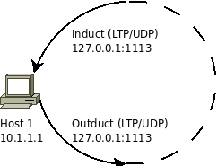
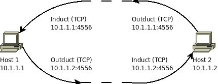
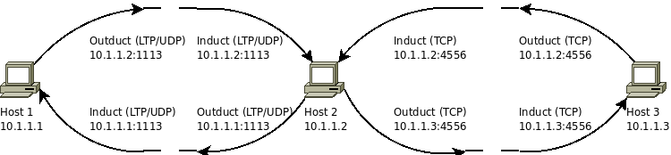

# ION Quick Start Guide

- [ION Quick Start Guide](#ion-quick-start-guide)
  - [Installing ION on Linux, MacOS, Solaris](#installing-ion-on-linux-macos-solaris)
    - [Build ION 4.1.3 (and earlier versions) without actual cipher suite](#build-ion-413-and-earlier-versions-without-actual-cipher-suite)
    - [Build ION 4.1.3s (and later version) with interface to actual cipher suite](#build-ion-413s-and-later-version-with-interface-to-actual-cipher-suite)
      - [Building ION to use the MBEDTLS cipher suite](#building-ion-to-use-the-mbedtls-cipher-suite)
    - [Adding Other Compile Time Switches](#adding-other-compile-time-switches)
    - [BPSec Logging](#bpsec-logging)
    - [Alternative Build Methods without Automake](#alternative-build-methods-without-automake)
      - [Method 1: Using Development Makefiles](#method-1-using-development-makefiles)
        - [Build Individual Packages](#build-individual-packages)
      - [Method 2: Using the ion-core Package](#method-2-using-the-ion-core-package)
  - [Windows](#windows)
  - [Running ION](#running-ion)
    - [Check Installed BP and ION versions](#check-installed-bp-and-ion-versions)
    - [Try the 'bping' test](#try-the-bping-test)
    - [Try to Setup a UDP Session](#try-to-setup-a-udp-session)
  - [Running multiple ION instances on a single host](#running-multiple-ion-instances-on-a-single-host)
  - [Setup UDP Configuration on Two Hosts](#setup-udp-configuration-on-two-hosts)
  - [Launch ION on two separate hosts](#launch-ion-on-two-separate-hosts)
  - [Run a bpdriver-bpcounter test](#run-a-bpdriver-bpcounter-test)
  - [Check the ion.log](#check-the-ionlog)
  - [bpacq and ltpacq files](#bpacq-and-ltpacq-files)
  - [Forced Shutdown of ION](#forced-shutdown-of-ion)
  - [Additional Tutorials](#additional-tutorials)
    - [ION Configuration File Tutorial](#ion-configuration-file-tutorial)
    - [ION Configuration File Template](#ion-configuration-file-template)
    - [ION NASA Course](#ion-nasa-course)
  - [Three ION Configuration File Examples](#three-ion-configuration-file-examples)
    - [Single-Node Loopback](#single-node-loopback)
      - [FILE: loopback.rc](#file-loopbackrc)
    - [Two-Node Network](#two-node-network)
      - [FILE: host1.rc](#file-host1rc)
      - [FILE: host2.rc](#file-host2rc)
    - [Three-Node Relay](#three-node-relay)
      - [FILE: host1.rc](#file-host1rc-1)
      - [FILE: host2.rc](#file-host2rc-1)
      - [FILE: host3.rc](#file-host3rc)
  - [Accessing ION Open-Source Code Repository](#accessing-ion-open-source-code-repository)
    - [Releases](#releases)
    - [Using the code repository](#using-the-code-repository)
  - [Contributing Code to ION](#contributing-code-to-ion)
    - [Expectations](#expectations)
  - [If you want to contribute code to ION](#if-you-want-to-contribute-code-to-ion)


## Installing ION on Linux, MacOS, Solaris

The recommended method to install ION on most Linux-based systems is to use the `automake` ecosystem. For this, you will need to make sure the following packages are installed and updated:

* `automake`
* `autoconf`
* `libtool`
* `m4`
* `gcc`
* `make`

Depending on the Linux distribution, the package names may differ. To install packages on Debian-based systems, run:

`sudo apt-get update && sudo apt-get install automake autoconf libtool m4 gcc make`

To verify the installation, run:

`automake --version`

`autoconf --version`

`libtool --version`

`m4 --version`

`gcc --version`

`make --version`

to check for proper installation.

NOTE: Alternative build methods without the `automake` ecosystem are also available. See section [Alternative Build Methods without Automake](#alternative-build-methods-without-automake) for details. 

### Build ION 4.1.3 (and earlier versions) without actual cipher suite

To build and install the entire ION system on a Linux, MacOS, or Solaris platform, cd into ion-open-source and enter the following commands:

`./configure`

If configure is not present run: `autoreconf -fi` first

`make`

`sudo make install`

Optionally, to run certain c-based regression tests, you need to build the test program from C code first. To do that, run:

`make test`

Then update the shared library cache of the linker:

`sudo ldconfig`

For MacOS, the `ldconfig` command is not present and not necessary.

### Build ION 4.1.3s (and later version) with interface to actual cipher suite

If you are not planning to use BPSec's interface to the MBEDTLS cipher suite, you can simply follow the build instruction for ION 4.1.3.

#### Building ION to use the MBEDTLS cipher suite

Before building ION, you should build and install MBEDTLS first. Download [MBEDTLS release 2.28.8 from GitHub.](https://github.com/Mbed-TLS/mbedtls/releases/tag/v2.28.8)

Assume your place the files in your home directory under `$HOME/mbedtls-2.28.2`. Now do the following:

1. Modify the file under `$HOME/mbedtls-2.28.2/include/mbedtls/config.h`
   * Uncomment the line `#define MBEDTLS_NIST_KW_C` and save the file.

2. Return to the root folder of MBEDTLS `$HOME/mbedtls-2.28.2` and build the shared libraries: `make SHARED=1`
3. Optionally, run `make check` to execute self-test on the MBEDTLS libraries. 
4. Install MBEDTLS shared library: `sudo make install`
    * The default library installation locations are `/usr/local/lib` and `/usr/local/include`. After the installation, verify the location of the library and header files. If the MBEDTLS shared libraries are not copied into the above locations, then make a note of the full path to the actual library and header files, which will need to be provided to ION during compilation.

Now we are ready to install ION. For the `./configure` command you need to enable MBEDTLS cipher suite interface using the `--enable-cypto-mbedtls` option. In additional, you may also optionally add the `--enable-bpsec-debugging` flag in you plan to run the BPSec related regression tests.

If the MBEDTLS library is not installed under the `/usr/local` prefix, then you will need to provide the path to the MBEDTLS library explicitly to ION by adding `MBED_LIB_PATH=<path-to-mbedtls-sharedlibrary> MBED_INC_PATH=<path-to-mbedtls-header-files>` to the `./configure` command.

After running `./configure` with the appropriate options/flags, you can build ION in the same way by:

`make`

`sudo make install`

`make test` (optional)

`sudo ldconfig`

To clean up compilation artifacts such as object files and shared libraries stored within the ION open-source directory, cd to the ION open-source directory and run:

`make clean`

To remove executables and shared libraries installed in the system, run:

`sudo make uninstall`

### Adding Other Compile Time Switches

If you want to set additional compile-time switches for a build, the place to do this to add them to the `./configure` command. To see a list of supported ION compiler options, see explanation provided by:

`./configure -h`

By default, Bundle Protocol V7 will be built and installed, but BPv6 source code is still available. The BPv6 implementation is essentially the same as that of ION 3.7.4, with only critical bugs being updated going forward. All users are encouraged to switch to BPV7.

To build BPv6, run

`./configure --enable-bpv6`

To build ION with enhanced watch character support, use the `--enable-ewchar` option.

To introduce customized build flags, you can add them via the `./configure` in this manner:

`./configure CFLAGS="<string of compiler options>"`

For example, say you want to add additional source code and header files from the `/wkdir/customfile` and activate certain features controlled by the `GDSLOGGER` and `GDSWATCHER` - software hooks to add time stamps to ion.log and writing time-stamped watch characters to a file for analysis. This can be accomplished through the `./configure` command as follows:

`./configure CFLAGS="-I/wkdir/customfile -DGDSLOGGER -DGDSWATCHER"`

### BPSec Logging

The BPSec implementation in ION provides 4 levels of debugging/logging:

1. __Function entry/exit logging__:  This logs the entry and exit of all major functions in the bpsec library and is useful for confirming control flow
 *    through the bpsec module.
2. __Information logging__:  Information statements are peppered through the code to provide insight into the state of the module at processing points considered useful by bpsec module software engineers.
3. __Warning logging__:  Warning statements are used to flag unexpected values that, based on runtime context, may not constitute errors.
4. __Error logging__:  Errors are areas in the code where some sanity check or other required condition fails to be met by the software.

Error logging within the BPSec module is of the form:

```
<id> <function name>: <message>
```

Where `id` is one of:

* `+` (function entry)
* `-` (function exit)
* `i` (information statement)
* `?` (warning statement)
* `x` (error statement)

To in order help users quickly verify their BP security configurations and operations are correct, the default BPSec logging level is set to 4 to provide per bundle status update in _ion.log_. This is also the level required for running the python-based BPSec regression tests in the ION distribution. This level of verbosity may be too high for operation or too low for in-depth debugging. Therefore, when needed, you can recompile ION to turn BPSec logging off or set a specific logging level based on your needs.

To run BPSec logging at default level, run

```bash
./configure --enable-bpsec-logging
```

To run BPSec without logging, simply omit the `--enable-bpsec-loggin` option.

To run BPSec logging at a specific level (1, 2, 3, or 4 - note 4 is the least verbose), run

```bash
./configure --enable-bpsec-logging=x
```

Where `x` is the desired logging level.

To enable the MBEDTLS cipher suite, you need to also add the `--enable-crypto-mbedtls` option when running the `./configure` script.

### Alternative Build Methods without Automake

If you do not wish to use the automake build system, you can build ION by using a set of development Makefiles or use the `ion-core` package.

#### Method 1: Using Development Makefiles

The ION distribution provides a set of Makefiles that does not rely on the automake system. This set of Makefile is by ION developer on Linux-based OS to offer more flexibility for compiling and debugging. 

Currently, the only actively maintained platform-specific development Makefile set is for 64-bits Linux under the "i86_48-fedora" folder in each module. If you choose this option, be aware of the following limitations:

For ION 4.1.1, 4.1.2 and 4.1.3:
* The development Makefiles are hierarchical. There is a top-level Makefile in the ION root directory and a set of Makefiles in the individual ION modules, under the "i86_48-fedora" subfolder. If you run `./configure` command, it will switch to the automake system and all development Makefiles will be renamed from `Makefile` to `Makefile.dev`.
  * If you used the automake system and want to revert to the development Makefiles, you should first run `make clean` and `make uninstall` to completely remove ION from the system because the two compilation method builds organizes shared libraries differently. Then you can either run `git stash` to restore the old Makefiles or simply pull a fresh copy of the code from the repo. 
* The development Makefiles, as they are, provides only the default compilation options  - similar to running `./configure` with no arguments. If you need to set specific compiler flags, you need to modify the Makefiles directly or pass a `ADD_FLAGS` argument to the `make all` command.
* The default directory for installation is `/usr/local/`, which usually requires sudo privilege. To override the installation prefix, change the value of `OPT` in the top-level Makefile of each package.

To build using the development Makefiles, cd to the ION root directory and run:

`make all`

OR if you need to set specific compiler flags, run: 

`make all ADD_FLAGS="<string of compiler options>"`

To install ION, run:

`sudo make install && sudo ldconfig`

To uninstall ION, run:

`sudo make uninstall`

To remove all build artifacts, run:

`make clean`

For ION 4.1.3s and later:

* ION will be released without any Makefile. The default build method is automake. You run `./configure` command, to create a single Makefile in the ION root directory.
* If you want to switch to use the development Makefiles, you need to first run `make clean` and `make uninstall` to completely remove ION from the system because the two compilation method builds organizes shared libraries differently. Then you can run the script `enable_manaul_build.sh` to clear the automake build system and replace it with the development Makefiles.

##### Build Individual Packages

It's also possible to build the individual packages of ION, using the development Makefiles in the package subdirectories. If you choose this option, be aware of the dependencies among the packages:

* The "ici" package must be built (run `make` and `make install`) before any other package.
* The "bp" package is dependent on "dgr" and "ltp" and "bssp" as well as "ici"
* The "cfdp", "ams", "bss", and "dtpc" packages are dependent on "bpv7"
* The "restart" package is dependent on "cfdp", "bp", "ltp", and "ici"

For more detailed instruction on building ION, see section 2 of the "ION Design and Operation Guide" document that is distributed with this package.

Additional details are provided in the README.txt files in the root directories of the subsystems.

All Makefiles are for gmake; on a FreeBSD platform, be sure to install gmake before trying to build ION.

#### Method 2: Using the ion-core Package

The `ion-core` package contains only a subset of essential BP functionalities - particular those features that are more stable and have been deployed for operations previously. The `ion-core` package can be downloaded [here](https://github.com/nasa-jpl/ion-core). Please following the `README.md` file there for installation instructions.

## Windows

To install ION for Windows, please download the Windows installer for ION 4.1.2 or earlier versions from the Source Forge archive [here](https://sourceforge.net/projects/ion-dtn/). 

For ION 4.1.3, no installer is provided. Instead, you can download the Windows installation instructions [here.](https://github.com/nasa-jpl/ION-DTN/blob/current/Building%20ION%20from%20source%20on%20Windows.pdf)

For ION 4.1.3s, a prototype automake build system will be been released for for beta testing.

## Running ION

### Check Installed BP and ION versions

Before running ION, let's confirm which version of Bundle Protocol is installed by running:

`bpversion`

You will see a simple string on the terminal windows indicating either "bpv6" or "bpv7".

Also check the ION version installed by running:

`ionadmin`

 At the  ":" prompt, please enter the single character command 'v' and you should see a response like this:

```
 $ ionadmin
: v
ION-OPEN-SOURCE-4.1.2
```

Then type 'q' to quit ionadmin. While ionadmin quits, it may display certain error messages like this:

```text
at line 427 of ici/library/platform_sm.c, Can't get shared memory segment: Invalid argument (0)
at line 312 of ici/library/memmgr.c, Can't open memory region.
at line 367 of ici/sdr/sdrxn.c, Can't open SDR working memory.
at line 513 of ici/sdr/sdrxn.c, Can't open SDR working memory.
at line 963 of ici/library/ion.c, Can't initialize the SDR system.
Stopping ionadmin.
```

This is normal due to the fact that ION has not launched yet.

### Try the 'bping' test

The `tests` directory contains regression tests used by system integrator to check ION before issuing each new release. To make sure ION is operating properly after installation, you can also manually run the bping test:

First enter the test directory: `cd tests`

Enter the command: `./runtests bping/`

This command invokes one of the simplest test whereby two ION instances are created and a ping message is sent from one to the other and an echo is returned to the sender of the ping.

During test, ION will display the configuration files used, clean the system of existing ION instances, relaunch ION according to the test configuration files, execute bping actions, display texts that indicates what the actions are being executed in real-time, and then shutdown ION, and display the final test status message, which looks like this:

```
ION node ended. Log file: ion.log
TEST PASSED!

passed: 1
    bping

failed: 0

skipped: 0

excluded by OS type: 0

excluded by BP version: 0

obsolete tests: 0
```

In this case, the test script confirms that ION is able to execute a bping function properly.

### Try to Setup a UDP Session

Under the `demos` folder of the ION code directory, there are benchmark tests for various ION configurations. These tests also provide a template of how to configure ION.

Take the example of the `bench-udp` demo:

Go into the `demos/bench-udp/` folder, you will see two subfolders: `2.bench.udp` and `3.bench.udp`, these folders configures two ION nodes, one with node numbers 2 and 3.

Looking inside the `2.bench.udp` folder, you will see specific files used to configure ION. These include:

```text
bench.bprc 
bench.ionconfig  
bench.ionrc  
bench.ionsecrc  
bench.ipnrc  
ionstart  
ionstop
```

* `bench.bprc` is the configuration file for the bundle protocol. To study the command options contained in this file, run `man bprc`.
* `bench.ionconfig` is the configuration file for the storage configuration of ION. See `man ionconfig` for details.
* `bench.ionrc` is the configuration file for ION. See `man ionrc` for details.
* `bench.ionsecrc` is the configuration file for ION security administration. See `man ionsecrc` for details.
* `bench.ipnrc` is the configuration file for the IPN  scheme. See `man ipnrc` for details.
* `ionstart` and `ionstop` are scripts to launch and shutdown ION.

One must note that ION distribution comes with a separate, global `ionstart` and `ionstop` scripts installed in `/usr/local/bin` that can launch and stop ION. The advantage of using local script is that it allows you customize the way you launch and stop ION, for example add helpful text prompt, perform additional checks and clean up activities, etc.

To run this demo test, first go into the test directory bench-udp, then run the dotest script:

`./dotest`

You can also study the test script to understand better what is happening.

## Running multiple ION instances on a single host

If you study the test script under the "tests" and the "demos" folders, you will realize that these tests often will launch 2 or 3 ION nodes on the same host to conduct the necessary tests. While this is necessary to simplify and better automate regression testing for ION developer and integration, it is not a typical, recommended configuration for new users.

In order to run multiple ION instances in one host, specific, different IPCS keys must be used for each instance, and several  variables must be set properly in the shell environment. Please see the ION Deployment Guide (included with the ION distribution) for more information on how to do that.

We recommend that most users, unless due to specific contrain that they must run multiple ION instance on one host, to run each ION instance on a separate host or (VM).

## Setup UDP Configuration on Two Hosts

Once you have studied these scripts, you can try to run it on two different machines running ION.

First, install ION in host A with an IP address of, for example, 192.168.0.2, and host B with an IP address of 192.168.0.3. Verify your installation based on earlier instructions.

Copy the `2.bench.udp` folder into host A and the `3.bench.udp` folder into host B.

Also copy the file `global.ionrc` from the `bench.udp` folder into the same folder where you placed `2.bench.udp` and `3.bench.udp`

Then you need to modify the IP addresses in the UDP demo configuration files to match the IP addresses of hosts A and B.

For example, the bprc files copied into host A is:

```text
1
a scheme ipn 'ipnfw' 'ipnadminep'
a endpoint ipn:2.0 x
a endpoint ipn:2.1 x
a endpoint ipn:2.2 x
a endpoint ipn:2.64 x
a endpoint ipn:2.65 x
a protocol udp 1400 100
a induct udp 127.0.0.1:2113 udpcli
a outduct udp 127.0.0.1:3113 'udpclo 1'
r 'ipnadmin bench.ipnrc'
s
```

To make it work for host A, you need to replace the induct ip address `127.0.0.1:2113` to `192.168.0.2:2113` - this is where host A's ION will receive incoming UDP traffic.

Similarly for outduct, you want to change the ip address from `127.0.0.1:3113` to `192.168.0.3:3113` - this is where UDP traffic will go out to host B.

You can make similar modifications to the ipnrc file as well.


In the ionconfig file, you want to comment out or delete the `wmKey` and `sdrName` entries. Since we are running these two nodes on different hosts, we always let ION use the default values for these parameters.

If you don’t do this you get an error on startup.

Repeat the same updates for host B by appropriately substituting old IP address to that of the new hosts.

## Launch ION on two separate hosts

After updating the configuration files on host A and B to reflect the new IP addresses and using default wmKey (by not specifying any), we are new ready to try launching ION.

Before you try to launch ION, it is recommended that you:

1. Use netcat or iperf to test the connection between host A and B. Make sure it is working properly. That means have a sufficiently high data rate and low loss rate (low single digit percent or fraction of a percent should not be a concern).
2. If iperf tests show that the data rate between the two hosts are at or above 800 megabits per second, in both directions, and the UDP loss rate is no more than a few percent, then you are good to go.
3. If not, then you want to reduce the data rate in the `global.ionrc` file, change the data rates for the `a contact` command down to something similar to your connection speed. Remember, the unit in the `global.ionrc` file is Bytes per second, not bits per second, which is typically what iperf test report uses.
4. If the error rate is high, you may want to check both the physical connection or kernel buffer setting.
5. Check firewall setting and MTU setting may help you narrow down problems.
6. Using wireshark can also be helpful both for initial connection check as well as during ION testing.

Once you are ready to launch ION on both host A and B, open a terminal and go to the directory where the configuration files are stored, and run the local ionstart script:

`./ionstart`

Note: do not run `ionstart` since that will trigger the global script in the execution PATH

You should see some standard output confirming that ION launch has completed. For example you might see something like this:

```text
Starting ION...
wmSize:          5000000
wmAddress:       0
sdrName:        'ion2'
sdrWmSize:       0
configFlags:     1
heapWords:       100000000
heapKey:         -1
logSize:         0
logKey:          -1
pathName:       '/tmp'
Stopping ionadmin.
Stopping ionadmin.
Stopping ionsecadmin.
Stopping ltpadmin.
Stopping ipnadmin.
Stopping bpadmin.
```

You can also see additional status information in the `ion.log` file in the same directory.

Launch ION on both host A and B.

## Run a bpdriver-bpcounter test

Now that we have launched ION on both host A and B, it's time to send some data.

We can repeat the bping test at this point. But since you have already seen that before, let's try something different.

Let's use the bpdriver-bpcounter test utilities. This pair of utility programs simply sends a number of data in bundles from one node to another and provides a measurement on the throughput.

On host B, run this command:

`bpcounter ipn:3.2 3`

This command tells ION node number 3 to be ready to receive three bundles on the end-point ID `ipn:3.2` which was specified in the `.bprc` file.

After host B has launched bpcounter, then on host A, run this command:

`bpdriver 3 ipn:2.2 ipn:3.2 -10000`

This command tells ION running in host A to send 3 bundles from EID 2.2 to EID 3.2, which is waiting for data (per bpcounter command.) And each bundle should be 10,000 bytes in size.

Why use the "-" sign in front of the size parameter? It's not a typo. The "-" indicates that bpdriver should keep sending bundles without waiting for any response from the receiver. The feature where bpdriver waits for the receiver is available in BPv6 but no longer part of BPv7.

When the test completed, you should see output indicating that all the data were sent, how many bundles were transmitted/received, and at what rate.

Please note that on the sending side the transmission may appear to be almost instantaneous. That is because bpdriver, as an application, is pushing data into bundle protocol which has the ability to rate buffer the data. So as soon as the bpdriver application pushes all data into the local bundle protocol agent, it considers the transmission completed and it will report a very high throughput value, one that is far above the contact graph's data rate limit. This is not an error; it simple report the throughput as experienced by the sending application, knowing that the data has not yet delivered fully to the destination.

Throughput reported by bpcounter, on the other hand, is quite accurate if a large number of bundles are sent. To accurately measure the time it takes to send the bundles, bpdriver program will send a "pilot" bundle just before sending the test data to signals to the bpcounter program to run its throughput calculation timer. This allows the user to run bpcounter and not haveing to worry about immediately send all the bundles in order to produce an accurate throughput measurement.

If you want to emulate the action of a constant rate source, instead of having bpdriver pushing all data as fast as possible, then you can use the 'i' option to specify a data rate throttle in bits per second.

If you want to know more about how bpdriver and bpcounter work, look up their man pages for details on syntax and command line options. Other useful ION test utility commands include `bpecho`, `bping`, `bpsource`, `bpsink`, `bpsendfile`, `bprecvfile`, etc.

## Check the ion.log

To confirm whether ION is running properly or has experienced an error, the first thing to do is to check the ion.log, which is a file created in the directory from which ION was launched. If an ion.log file exists when ION starts, it will simply append additional log entries into that file. Each entry has a timestamp to help you determine the time and the relative order in which events occurred.

When serious error occurs, ion.log  will have detailed messages that can pinpoint the name  and line number of the source code where the error was reported or triggered.

## bpacq and ltpacq files

Sometimes after operating ION for a while, you will notice a number of files with names such as "bpacq" or "ltpacq" followed by a number. These are temporary files created by ION to stage bundles or LTP blocks during reception and processing.  Once a bundle or LTP block is completely constructed, delivered, or cancelled properly, these temporary files are automatically removed by ION. But if ION experiences an anomalous shutdown, then these files may remain and accumulate in the local directory.

It is generally safe to remove these files between ION runs. Their presence does not automatically imply issues with ION but can indicate that ION operations were interrupted for some reason. By noting their creation time stamp, it can provide clues on when these interruptions occurred. Right now there are no ION utilty program to parse them because these files are essentially bit buckets and do not contain internal markers or structure and allows user to parse them or extract information by processes outside the bundle agents that created them in the first place.

## Forced Shutdown of ION

Sometimes shutting down ION does not go smoothly and you can't seem to relaunch ION properly. In that case, you can use the global `ionstop` script (or the `killm` script) to kill all ION processes that did not terminate using local ionstop script. The global ionstop or killm scripts also clears out the IPC shared memory and semaphores allocations that were locked by ION processes and would not terminate otherwise.

## Additional Tutorials

### ION Configuration File Tutorial

To learn about the configuration files and the basic set of command syntax and functions:
[ION Config File Tutorial](./Basic-Configuration-File-Tutorial.md)

### ION Configuration File Template

[ION Config File Template](./ION-Config-File-Templates.md)

### ION NASA Course

To learn more about the design principle of ION and how to use it, a complete series of tutorials is available here:
[NASA ION Course](https://www.nasa.gov/directorates/heo/scan/engineering/technology/disruption_tolerant_networking_software_options_ion)

The ION Dev Kit mentioned in the NASA ION Course had been deprecated. However, some additional helpful files can be found here to complete the examples:
[Additional DevKit Files](https://sourceforge.net/p/ion-dtn/wiki/DevKit%20-%20additional%20materials/)


## Three ION Configuration File Examples

In this section, we provide three configuration file examples with detailed comments explaining the configuration commands. The three examples are:
* Singe Node Loopback over LTP
* Two Nodes over TCPCL
* Three Node with a relay using LTP and TCPCL

### Single-Node Loopback



Here is an example configuration file for "loopback.rc" using LTP as the primary convergence layer:

#### FILE: loopback.rc
```text
## Run the following command to start ION node:
##  % ionstart -I "loopback.rc"

## begin ionadmin 
# ionrc configuration file for loopback test.
#   This uses ltp as the primary convergence layer.
#   command: % ionadmin loopback.ionrc
#   This command should be run FIRST.
#
#   Ohio University, Oct 2008

# Initialization command (command 1). 
#   Set this node to be node 1 (as in ipn:1).
#   Use default sdr configuration (empty configuration file name "").
1 1 ""

# start ion node
s

# Add a contact.
#   It will start at +1 seconds from now, ending +3600 seconds from now.
#   It will connect node 1 to itself
#   It will transmit 100000 bytes/second.
a contact +1 +3600 1 1 100000

# Add a range. This is the physical distance between nodes.
#   It will start at +1 seconds from now, ending +3600 seconds from now.
#   It will connect node 1 to itself.
#   Data on the link is expected to take 1 second to reach the other
#   end (One Way Light Time).
a range +1 +3600 1 1 1

# set this node to consume and produce a mean of 1000000 bytes/second.
m production 1000000
m consumption 1000000
## end ionadmin 

## begin ltpadmin 
# ltprc configuration file for the loopback test.
#   Command: % ltpadmin loopback.ltprc
#   This command should be run AFTER ionadmin and BEFORE bpadmin.
#
#   Ohio University, Oct 2008

# Initialization command (command 1).
#   We estimate that the total number of export sessions managed by the 
#       LTP engine will be 32.  A session is assumed to be around one
#   second of transmission.  This value should be estimated at the sum
#   of maximum round-trip times (in seconds) for all "spans."
#   Suggest throwing 20% higher number of sessions to account for extra-
#   long sessions which contain an actual retransmission.
1 32

# Add a span. (a connection) 
#   Identify the span as engine number 1.
#       Limit the number of export and imports sessions on this span
#       to 10 to ensure we do not consume all space.
#   Use 1400 byte segments (assuming a standard ethernet frame
#   underlying this link and accounting for ip/udp/eth header overhead).
#   Use a block size aggregation limit of 10000 bytes.  This is the amount
#   of data (which can span several bundles) typically sent in a session.
#   You should consider this to be the maximum number of bytes sent in
#   one second on the link.
#       Use a block time aggregation limit of 1 second; if 1 second passes
#       and the amount of data accumulated in the current block
#       is less than the limit, send the block anyway.
#   Use the command 'udplso localhost:1113' to implement the link
#   itself.  In this case, we use udp to connect to localhost (this is
#   loopback) using port 1113 (defined by IANA as the default UDP port
#   for Licklider Transmission Protocol).  The single quote is
#   important, don't use double quotes.
a span 1 10 10 1400 10000 1 'udplso localhost:1113'

# Start command.
#   This command actually runs the link service output commands
#   (defined above, in the "a span" command).
#   Also starts the link service INPUT task 'udplsi localhost:1113' to
#   listen locally on UDP port 1113 for incoming LTP traffic.
s 'udplsi localhost:1113'
## end ltpadmin 

## begin bpadmin 
# bprc configuration file for the loopback test.
#   Command: % bpadmin loopback.bprc
#   This command should be run AFTER ionadmin and ltpadmin and 
#   BEFORE ipnadmin or dtnadmin.
#
#   Ohio University, Oct 2008

# Initialization command (command 1).
#   Use ipn:1.0 as the custodian endpoint of this node.
#   That is, scheme IPN with node 1 and service number 0
#   (ipn requires custodian service is zero).
#   Note that this EID must be understood by the node itself, so be sure
#   to add the scheme below.
1 ipn:1.0

# Add an EID scheme.
#   The scheme's name is ipn.
>#  This scheme's forwarding engine is handled by the program 'ipnfw.'
#   This scheme's administration program (acting as the custodian
#   daemon) is 'ipnadminep.'
a scheme ipn 'ipnfw' 'ipnadminep'

# Add endpoints.
#   Establish endpoints ipn:1.0, ipn:1.1, and ipn:1.2 on the local node.
#   ipn:1.0 is expected for custodian traffic.  The rest are usually
#   used for specific applications (such as bpsink).
#   The behavior for receiving a bundle when there is no application
#   currently accepting bundles, is to queue them 'q', as opposed to
#   immediately and silently discarding them (use 'x' instead of 'q' to
#   discard).
a endpoint ipn:1.0 q
a endpoint ipn:1.1 q
a endpoint ipn:1.2 q

# Add a protocol. 
#   Add the protocol named ltp.
#   Estimate transmission capacity assuming 1400 bytes of each frame (in
#   this case, udp on ethernet) for payload, and 100 bytes for overhead.
a protocol ltp 1400 100

# Add an induct. (listen)
#   Add an induct to accept bundles using the ltp protocol.
#   The duct's name is 1 (this is for future changing/deletion of the
#   induct).
#   The induct itself is implemented by the 'ltpcli' command.
a induct ltp 1 ltpcli

# Add an outduct (send to yourself).
#   Add an outduct to send bundles using the ltp protocol.
#   The duct's name is 1 (this is for future changing/deletion of the
#   outduct).
#   The outduct itself is implemented by the 'ltpclo' command.
a outduct ltp 1 ltpclo

# Start bundle protocol engine, also running all of the induct, outduct,
# and administration programs defined above
s
## end bpadmin 

## begin ipnadmin 
# ipnrc configuration file for the loopback test.
#   Essentially, this is the IPN scheme's routing table.
#   Command: % ipnadmin loopback.ipnrc
#   This command should be run AFTER bpadmin (likely to be run last).
#
#   Ohio University, Oct 2008

# Add an egress plan.
#   Bundles to be transmitted to node number 1 (that is, yourself).
#   The plan is to queue for transmission on protocol 'ltp' using
#   the outduct identified as '1.'
#   See your bprc file or bpadmin for outducts/protocols you can use.
a plan 1 ltp/1
## end ipnadmin
```
### Two-Node Network



In this section, we assume that host1 has an IP address of 10.1.1.1 and host2 has an IP address of 10.1.1.2. Please modify this for your uses.

Note that this example network uses a different convergence layer: TCP.

#### FILE: host1.rc
```text
## Run the following command to start ION node:
## % ionstart -I "host1.rc"

## begin ionadmin
# ionrc configuration file for host1 in a 2node tcp test.
# This uses tcp as the primary convergence layer.
# command: % ionadmin host1.ionrc
# This command should be run FIRST.
#
# Ohio University, Oct 2008

# Initialization command (command 1).
# Set this node to be node 1 (as in ipn:1).
# Use default sdr configuration (empty configuration file name "").
1 1 ""

# start ion node
s

# Add a contact.
# It will start at +1 seconds from now, ending +3600 seconds from now.
# It will connect node 1 to itself
# It will transmit 100000 bytes/second.
a contact +1 +3600 1 1 100000

# Add more contacts.
# They will connect 1 to 2, 2 to 1, and 2 to itself
# Note that contacts are unidirectional, so order matters.
a contact +1 +3600 1 2 100000
a contact +1 +3600 2 1 100000
a contact +1 +3600 2 2 100000

# Add a range. This is the physical distance between nodes.
# It will start at +1 seconds from now, ending +3600 seconds from now.
# It will connect node 1 to itself.
# Data on the link is expected to take 1 second to reach the other
# end (One Way Light Time).
a range +1 +3600 1 1 1

# Add more ranges.
# We will assume every range is one second.
# Note that ranges cover both directions, so you only need define
# one range for any combination of nodes.
a range +1 +3600 2 2 1
a range +1 +3600 2 1 1

# set this node to consume and produce a mean of 1000000 bytes/second.
m production 1000000
m consumption 1000000
## end ionadmin

## begin bpadmin
# bprc configuration file for host1 in a 2node test.
# Command: % bpadmin host1.bprc
# This command should be run AFTER ionadmin and BEFORE ipnadmin
# or dtnadmin.
#
# Ohio University, Oct 2008

# Initialization command (command 1).
1

# Add an EID scheme.
# The scheme's name is ipn.
# This scheme's forwarding engine is handled by the program 'ipnfw.'
# This scheme's administration program (acting as the custodian
# daemon) is 'ipnadminep.'
a scheme ipn 'ipnfw' 'ipnadminep'

# Add endpoints.
# Establish endpoints ipn:1.0, ipn:1.1, and ipn:1.2 on the local node.
# ipn:1.0 is expected for custodian traffic. The rest are usually
# used for specific applications (such as bpsink).
# The behavior for receiving a bundle when there is no application
# currently accepting bundles, is to dump them 'x', as opposed to
# queueing them (use 'q' instead of 'x' to queue).
a endpoint ipn:1.0 x
a endpoint ipn:1.1 x
a endpoint ipn:1.2 x

# Add a protocol.
# Add the protocol named tcp.
# Estimate transmission capacity assuming 1400 bytes of each frame (in
# this case, tcp on ethernet) for payload, and 100 bytes for overhead.
a protocol tcp 1400 100

# Add an induct. (listen)
# Add an induct to accept bundles using the tcp protocol.
# The induct will listen at this host's IP address (private testbed).
# The induct will listen on port 4556, the IANA assigned default DTN
# TCP convergence layer port.
# The induct itself is implemented by the 'tcpcli' command.
a induct tcp 10.1.1.1:4556 tcpcli

# Add an outduct (send to yourself).
# Add an outduct to send bundles using the tcp protocol.
# The outduct will connect to the IP address 10.1.1.1 using the
# IANA assigned default DTN TCP port of 4556.
# The outduct itself is implemented by the 'tcpclo' command.
a outduct tcp 10.1.1.1:4556 tcpclo

# Add an outduct. (send to host2)
# Add an outduct to send bundles using the tcp protocol.
# The outduct will connect to the IP address 10.1.1.2 using the
# IANA assigned default DTN TCP port of 4556.
# The outduct itself is implemented by the 'tcpclo' command.
a outduct tcp 10.1.1.2:4556 tcpclo

# Start bundle protocol engine, also running all of the induct, outduct,
# and administration programs defined above.
s
## end bpadmin

## begin ipnadmin
# ipnrc configuration file for host1 in the 2node tcp network.
# Essentially, this is the IPN scheme's routing table.
# Command: % ipnadmin host1.ipnrc
# This command should be run AFTER bpadmin (likely to be run last).
#
# Ohio University, Oct 2008

# Add an egress plan (to yourself).
# Bundles to be transmitted to node number 1 (that is, yourself).
# The plan is to queue for transmission on protocol 'tcp' using
# the outduct identified as '10.1.1.1:4556'
# See your bprc file or bpadmin for outducts/protocols you can use.
a plan 1 tcp/10.1.1.1:4556

# Add an egress plan. (to the second host)
# Bundles to be transmitted to node number 2 (the other node).
# The plan is to queue for transmission on protocol 'tcp' using
# the outduct identified as '10.1.1.2:4556'
# See your bprc file or bpadmin for outducts/protocols you can use.
a plan 2 tcp/10.1.1.2:4556
## end ipnadmin
```

#### FILE: host2.rc
```text
## Run the following command to start ION node:
##  % ionstart -I "host2.rc"

## begin ionadmin 
# ionrc configuration file for host2 in a 2node tcp test.
#   This uses tcp as the primary convergence layer.
#   command: % ionadmin host2.ionrc
#   This command should be run FIRST.
#
#   Ohio University, Oct 2008

# Initialization command (command 1). 
#   Set this node to be node 2 (as in ipn:2).
#   Use default sdr configuration (empty configuration file name "").
1 2 ""

# start ion node
s

# Add a contact.
#   It will start at +1 seconds from now, ending +3600 seconds from now.
#   It will connect node 1 to itself
#   It will transmit 100000 bytes/second.
a contact +1 +3600 1 1 100000

# Add more contacts.
#   They will connect 1 to 2, 2 to 1, and 2 to itself
#   Note that contacts are unidirectional, so order matters.
a contact +1 +3600 1 2 100000
a contact +1 +3600 2 1 100000
a contact +1 +3600 2 2 100000

# Add a range. This is the physical distance between nodes.
#   It will start at +1 seconds from now, ending +3600 seconds from now.
#   It will connect node 1 to itself.
#   Data on the link is expected to take 1 second to reach the other
#   end (One Way Light Time).
a range +1 +3600 1 1 1

# Add more ranges.
#   We will assume every range is one second.
#   Note that ranges cover both directions, so you only need define
#   one range for any combination of nodes.
a range +1 +3600 2 2 1
a range +1 +3600 2 1 1

# set this node to consume and produce a mean of 1000000 bytes/second.
m production 1000000
m consumption 1000000
## end ionadmin 

## begin bpadmin 
# bprc configuration file for host2 in a 2node test.
#   Command: % bpadmin host2.bprc
#   This command should be run AFTER ionadmin and BEFORE ipnadmin
#   or dtnadmin.
#
#   Ohio University, Oct 2008

# Initialization command (command 1).
1

# Add an EID scheme.
#   The scheme's name is ipn.
#   This scheme's forwarding engine is handled by the program 'ipnfw.'
#   This scheme's administration program (acting as the custodian
#   daemon) is 'ipnadminep.'
a scheme ipn 'ipnfw' 'ipnadminep'

# Add endpoints.
#   Establish endpoints ipn:2.0, ipn:2.1, and ipn:2.2 on the local node.
#   ipn:2.0 is expected for custodian traffic.  The rest are usually
#   used for specific applications (such as bpsink).
#   The behavior for receiving a bundle when there is no application
#   currently accepting bundles, is to dump them 'x', as opposed to
#   queueing them (use 'q' instead of 'x' to queue).
a endpoint ipn:2.0 x
a endpoint ipn:2.1 x
a endpoint ipn:2.2 x

# Add a protocol. 
#   Add the protocol named tcp.
#   Estimate transmission capacity assuming 1400 bytes of each frame (in
#   this case, tcp on ethernet) for payload, and 100 bytes for overhead.
a protocol tcp 1400 100

# Add an induct. (listen)
#   Add an induct to accept bundles using the tcp protocol.
#   The induct will listen at this host's IP address (private testbed).
#   The induct will listen on port 4556, the IANA assigned default DTN
#   TCP convergence layer port.
#   The induct itself is implemented by the 'tcpcli' command.
a induct tcp 10.1.1.2:4556 tcpcli

# Add an outduct (send to yourself).
#   Add an outduct to send bundles using the tcp protocol.
#   The outduct will connect to the IP address 10.1.1.2 using the
#   IANA assigned default DTN TCP port of 4556.
#   The outduct itself is implemented by the 'tcpclo' command.
a outduct tcp 10.1.1.2:4556 tcpclo

# Add an outduct. (send to host1)
#   Add an outduct to send bundles using the tcp protocol.
#   The outduct will connect to the IP address 10.1.1.1 using the
#   IANA assigned default DTN TCP port of 4556.
#   The outduct itself is implemented by the 'tcpclo' command.
a outduct tcp 10.1.1.1:4556 tcpclo

# Start bundle protocol engine, also running all of the induct, outduct,
# and administration programs defined above.
s
## end bpadmin 

## begin ipnadmin 
# ipnrc configuration file for host1 in the 2node tcp network.
#   Essentially, this is the IPN scheme's routing table.
#   Command: % ipnadmin host2.ipnrc
#   This command should be run AFTER bpadmin (likely to be run last).
#
#   Ohio University, Oct 2008

# Add an egress plan (to yourself).
#   Bundles to be transmitted to node number 2 (that is, yourself).
#   The plan is to queue for transmission on protocol 'tcp' using
#   the outduct identified as '10.1.1.2:4556'
#   See your bprc file or bpadmin for outducts/protocols you can use.
a plan 2 tcp/10.1.1.2:4556

# Add an egress plan. (to the other host)
#   Bundles to be transmitted to node number 1 (the other node).
#   The plan is to queue for transmission on protocol 'tcp' using
#   the outduct identified as '10.1.1.1:4556'
#   See your bprc file or bpadmin for outducts/protocols you can use.
a plan 1 tcp/10.1.1.1:4556
## end ipnadmin
```

### Three-Node Relay



In this section, we assume that host1 has an IP address of 10.1.1.1, host2 has an IP address of 10.1.1.2, and host3 has an IP address of 10.1.1.3. Please modify this for your uses.

You will notice that this network uses host2 as a router in between host1 and host3. At this point, routing is handled by creating a group from the remote node and using the middle node as the gateway. Notice how host1 will take traffic for host3 and transmit it on the same outduct to host2, the next hop. Host3 will transmit traffic destined for host1 on the outduct for host2, also the next hop.

Also note that this network uses both LTP and TCP convergence layers.

#### FILE: host1.rc
```text
## File created by ../../ionscript
## Wed Oct 29 17:33:43 EDT 2008
## Run the following command to start ION node:
##  % ionstart -I "host1.rc"

## begin ionadmin 
# ionrc configuration file for host1 in a 3node tcp/ltp test.
#   This uses ltp from 1 to 2 and ltp from 2 to 3.
#   command: % ionadmin host1.ionrc
#   This command should be run FIRST.
#
#   Ohio University, Oct 2008

# Initialization command (command 1). 
#   Set this node to be node 1 (as in ipn:1).
#   Use default sdr configuration (empty configuration file name "").
1 1 ""

# start ion node
s

# Add a contact.
#   It will start at +1 seconds from now, ending +3600 seconds from now.
#   It will connect node 1 to itself.
#   It will transmit 100000 bytes/second.
a contact +1 +3600 1 1 100000

# Add more contacts.
#   The network goes 1--2--3
#   Note that contacts are unidirectional, so order matters.
a contact +1 +3600 1 2 100000
a contact +1 +3600 2 1 100000
a contact +1 +3600 2 2 100000
a contact +1 +3600 2 3 100000
a contact +1 +3600 3 2 100000
a contact +1 +3600 3 3 100000

# Add a range. This is the physical distance between nodes.
#   It will start at +1 seconds from now, ending +3600 seconds from now.
#   It will connect node 1 to itself.
#   Data on the link is expected to take 1 second to reach the other
#   end (One Way Light Time).
a range +1 +3600 1 1 1

# Add more ranges.
#   We will assume every range is one second.
#   Note that ranges cover both directions, so you only need define
#   one range for any combination of nodes.
a range +1 +3600 1 2 1
a range +1 +3600 1 3 2
a range +1 +3600 2 2 1
a range +1 +3600 2 3 1
a range +1 +3600 3 3 1

# set this node to consume and produce a mean of 1000000 bytes/second.
m production 1000000
m consumption 1000000
## end ionadmin 

## begin ltpadmin 
# ltprc configuration file for host1 in a 3node ltp/tcp test.
#   Command: % ltpadmin host1.ltprc
#   This command should be run AFTER ionadmin and BEFORE bpadmin.
#
#   Ohio University, Oct 2008

# Initialization command (command 1).
1 32

# Add a span. (a connection)
a span 1 10 10 1400 10000 1 'udplso 10.1.1.1:1113'

# Add another span. (to host2) 
#   Identify the span as engine number 2.
#   Use the command 'udplso 10.1.1.2:1113' to implement the link
#   itself.  In this case, we use udp to connect to host2 using the
#   default port.
a span 2 10 10 1400 10000 1 'udplso 10.1.1.2:1113'

# Start command.
#   This command actually runs the link service output commands
#   (defined above, in the "a span" commands).
#   Also starts the link service INPUT task 'udplsi 10.1.1.1:1113' to
#   listen locally on UDP port 1113 for incoming LTP traffic.
s 'udplsi 10.1.1.1:1113'
## end ltpadmin 

## begin bpadmin 
# bprc configuration file for host1 in a 3node ltp/tcp test.
#   Command: % bpadmin host1.bprc
#   This command should be run AFTER ionadmin and ltpadmin and 
#   BEFORE ipnadmin or dtnadmin.
#
#   Ohio University, Oct 2008

# Initialization command (command 1).
1

# Add an EID scheme.
#   The scheme's name is ipn.
#   This scheme's forwarding engine is handled by the program 'ipnfw.'
#   This scheme's administration program (acting as the custodian
#   daemon) is 'ipnadminep.'
a scheme ipn 'ipnfw' 'ipnadminep'

# Add endpoints.
#   Establish endpoints ipn:1.0, ipn:1.1, and ipn:1.2 on the local node.
#   ipn:1.0 is expected for custodian traffic.  The rest are usually
#   used for specific applications (such as bpsink).
#   The behavior for receiving a bundle when there is no application
#   currently accepting bundles, is to queue them 'q', as opposed to
#   immediately and silently discarding them (use 'x' instead of 'q' to
#   discard).
a endpoint ipn:1.0 x
a endpoint ipn:1.1 x
a endpoint ipn:1.2 x

# Add a protocol. 
#   Add the protocol named ltp.
#   Estimate transmission capacity assuming 1400 bytes of each frame (in
#   this case, udp on ethernet) for payload, and 100 bytes for overhead.
a protocol ltp 1400 100

# Add an induct. (listen)
#   Add an induct to accept bundles using the ltp protocol.
#   The duct's name is 1 (this is for future changing/deletion of the
#   induct). 
#   The induct itself is implemented by the 'ltpcli' command.
a induct ltp 1 ltpcli

# Add an outduct (send to yourself).
#   Add an outduct to send bundles using the ltp protocol.
#   The duct's name is 1 (this is for future changing/deletion of the
#   outduct). The name should correspond to a span (in your ltprc).
#   The outduct itself is implemented by the 'ltpclo' command.
a outduct ltp 1 ltpclo
# NOTE: what happens if 1 does not match the id of an ltp span?

# Add an outduct. (send to host2)
#   Add an outduct to send bundles using the ltp protocol.
#   The duct's name is 2 (this is for future changing/deletion of the
#   outduct). The name should correpsond to a span (in your ltprc).
#   The outduct itself is implemented by the 'ltpclo' command.
a outduct ltp 2 ltpclo

# Start bundle protocol engine, also running all of the induct, outduct,
# and administration programs defined above
s
## end bpadmin 

## begin ipnadmin 
# ipnrc configuration file for host1 in a 3node ltp/tcp test. 
#   Essentially, this is the IPN scheme's routing table.
#   Command: % ipnadmin host1.ipnrc
#   This command should be run AFTER bpadmin (likely to be run last).
#
#   Ohio University, Oct 2008

# Add an egress plan.
#   Bundles to be transmitted to node number 1 (that is, yourself).
#   The plan is to queue for transmission on protocol 'ltp' using
#   the outduct identified as '1.'
#   See your bprc file or bpadmin for outducts/protocols you can use.
a plan 1 ltp/1

# Add other egress plans.
#   Bundles for elemetn 2 can be transmitted directly to host2 using
#   ltp outduct identified as '2.' See bprc file for available outducts
#   and/or protocols.
a plan 2 ltp/2

# Add a group static route
#   host 3 is not a neighbor to host1, but it is a neighbor to host2.
#   send bundles for 3 via 2.
a group 3 3 ipn:2.0
## end ipnadmin
```

#### FILE: host2.rc
```text
## File created by ../../ionscript
## Wed Oct 29 17:33:43 EDT 2008
## Run the following command to start ION node:
##  % ionstart -I "host2.rc"

## begin ionadmin 
# ionrc configuration file for host2 in a 3node tcp/ltp test.
#   This uses ltp from 1 to 2 and ltp from 2 to 3.
#   command: % ionadmin host2.ionrc
#   This command should be run FIRST.
#
#   Ohio University, Oct 2008

# Initialization command (command 1). 
#   Set this node to be node 2 (as in ipn:2).
#   Use default sdr configuration (empty configuration file name "").
1 2 ""

# start ion node
s

# Add a contact.
#   It will start at +1 seconds from now, ending +3600 seconds from now.
#   It will connect node 1 to itself.
#   It will transmit 100000 bytes/second.
a contact +1 +3600 1 1 100000

# Add more contacts.
#   The network goes 1--2--3
#   Note that contacts are unidirectional, so order matters.
a contact +1 +3600 1 2 100000
a contact +1 +3600 2 1 100000
a contact +1 +3600 2 2 100000
a contact +1 +3600 2 3 100000
a contact +1 +3600 3 2 100000
a contact +1 +3600 3 3 100000

# Add a range. This is the physical distance between nodes.
#   It will start at +1 seconds from now, ending +3600 seconds from now.
#   It will connect node 1 to itself.
#   Data on the link is expected to take 1 second to reach the other
#   end (One Way Light Time).
a range +1 +3600 1 1 1

# Add more ranges.
#   We will assume every range is one second.
#   Note that ranges cover both directions, so you only need define
#   one range for any combination of nodes.
a range +1 +3600 1 2 1
a range +1 +3600 1 3 2
a range +1 +3600 2 2 1
a range +1 +3600 2 3 1
a range +1 +3600 3 3 1

# set this node to consume and produce a mean of 1000000 bytes/second.
m production 1000000
m consumption 1000000
## end ionadmin 

## begin ltpadmin 
# ltprc configuration file for host2 in a 3node ltp/tcp test.
#   Command: % ltpadmin host2.ltprc
#   This command should be run AFTER ionadmin and BEFORE bpadmin.
#
#   Ohio University, Oct 2008

# Initialization command (command 1).
1 32

# Add a span. (a connection) 
#   Identify the span as engine number 1.
#   Use the command 'udplso 10.1.1.1:1113' to implement the link
#   itself.  In this case, we use udp to connect to the local machine
#   (loopback) using port 1113 (defined by IANA as the default UDP port
#   for Licklider Transmission Protocol).  The single quote is
#   important, don't use double quotes.
a span 1 10 10 1400 10000 1 'udplso 10.1.1.1:1113'

# Add another span (to yourself).
#   Identify the span as engine number 2.
#   Use the command 'udplso 10.1.1.2:1113' to implement the link
#   itself.  In this case, we use udp to connect to host2 using the
#   default port.
a span 2 10 10 1400 10000 1 'udplso 10.1.1.2:1113'

# Start command.
#   This command actually runs the link service output commands
#   (defined above, in the "a span" commands).
#   Also starts the link service INPUT task 'udplsi 10.1.1.2:1113' to
#   listen locally on UDP port 1113 for incoming LTP traffic.
s 'udplsi 10.1.1.2:1113'
## end ltpadmin 

## begin bpadmin 
# bprc configuration file for host2 in a 3node ltp/tcp test.
#   Command: % bpadmin host2.bprc
#   This command should be run AFTER ionadmin and ltpadmin and 
#   BEFORE ipnadmin or dtnadmin.
#
#   Ohio University, Oct 2008

# Initialization command (command 1).
1

# Add an EID scheme.
#   The scheme's name is ipn.
#   This scheme's forwarding engine is handled by the program 'ipnfw.'
#   This scheme's administration program (acting as the custodian
#   daemon) is 'ipnadminep.'
a scheme ipn 'ipnfw' 'ipnadminep'

# Add endpoints.
#   Establish endpoints ipn:2.0, ipn:2.1, and ipn:2.2 on the local node.
#   ipn:2.0 is expected for custodian traffic.  The rest are usually
#   used for specific applications (such as bpsink).
#   The behavior for receiving a bundle when there is no application
#   currently accepting bundles, is to queue them 'q', as opposed to
#   immediately and silently discarding them (use 'x' instead of 'q' to
#   discard).
a endpoint ipn:2.0 x
a endpoint ipn:2.1 x
a endpoint ipn:2.2 x

# Add a protocol. 
#   Add the protocol named ltp.
#   Estimate transmission capacity assuming 1400 bytes of each frame (in
#   this case, udp on ethernet) for payload, and 100 bytes for overhead.
a protocol ltp 1400 100

# Add a protocol. 
#   Add the protocol named tcp.
#   Estimate transmission capacity assuming 1400 bytes of each frame (in
#   this case, tcp on ethernet) for payload, and 100 bytes for overhead.
a protocol tcp 1400 100

# Add an induct. (listen)
#   Add an induct to accept bundles using the ltp protocol.
#   The duct's name is 2 (this is for future changing/deletion of the
#   induct). 
#   The induct itself is implemented by the 'ltpcli' command.
a induct ltp 2 ltpcli

# Add an induct. (listen)
#   Add an induct to accept bundles using the tcp protocol.
#   The induct will listen at this host's IP address (private testbed).
#   The induct will listen on port 4556, the IANA assigned default DTN
#   TCP convergence layer port.
#   The induct itself is implemented by the 'tcpcli' command.
a induct tcp 10.1.1.2:4556 tcpcli

# Add an outduct (send to yourself).
#   Add an outduct to send bundles using the tcp protocol.
#   The outduct will connect to the IP address 10.1.1.2 using the
#   IANA assigned default DTN TCP port of 4556.
#   The outduct itself is implemented by the 'tcpclo' command.
a outduct tcp 10.1.1.2:4556 tcpclo

# Add an outduct. (send to host3)
#   Add an outduct to send bundles using the tcp protocol.
#   The outduct will connect to the IP address 10.1.1.3 using the
#   IANA assigned default DTN TCP port of 4556.
#   The outduct itself is implemented by the 'tcpclo' command.
a outduct tcp 10.1.1.3:4556 tcpclo

# Add an outduct. (send to host1)
#   Add an outduct to send bundles using the ltp protocol.
#   The duct's name is 1 (this is for future changing/deletion of the
#   outduct). The name should correpsond to a span (in your ltprc).
#   The outduct itself is implemented by the 'ltpclo' command.
a outduct ltp 1 ltpclo

# Start bundle protocol engine, also running all of the induct, outduct,
# and administration programs defined above
s
## end bpadmin 

## begin ipnadmin 
# ipnrc configuration file for host2 in a 3node ltp/tcp test. 
#   Essentially, this is the IPN scheme's routing table.
#   Command: % ipnadmin host2.ipnrc
#   This command should be run AFTER bpadmin (likely to be run last).
#
#   Ohio University, Oct 2008

# Add an egress plan (to yourself).
#   Bundles to be transmitted to node number 2 (that is, yourself).
#   The plan is to queue for transmission on protocol 'tcp' using
#   the outduct identified as '10.1.1.2:4556'
#   See your bprc file or bpadmin for outducts/protocols you can use.
a plan 2 tcp/10.1.1.2:4556

# Add an egress plan. (to host3)
#   Bundles to be transmitted to node number 3 (the other node).
#   The plan is to queue for transmission on protocol 'tcp' using
#   the outduct identified as '10.1.1.3:4556'
#   See your bprc file or bpadmin for outducts/protocols you can use.
a plan 3 tcp/10.1.1.3:4556

# Add an egress plan. (to host1)
#   Bundles to be transmitted to node number 1.
#   The plan is to queue for transmission on protocol 'ltp' using
#   the outduct identified as '1.'
#   See your bprc file or bpadmin for outducts/protocols you can use.
a plan 1 ltp/1
## end ipnadmin
```

#### FILE: host3.rc
```text
## File created by ../../ionscript
## Wed Oct 29 17:33:43 EDT 2008
## Run the following command to start ION node:
##  % ionstart -I "host3.rc"

## begin ionadmin 
# ionrc configuration file for host3 in a 3node tcp/ltp test.
#   This uses ltp from 1 to 2 and ltp from 2 to 3.
#   command: % ionadmin host3.ionrc
#   This command should be run FIRST.
#
#   Ohio University, Oct 2008

# Initialization command (command 1). 
#   Set this node to be node 3 (as in ipn:3).
#   Use default sdr configuration (empty configuration file name "").
1 3 ""

# start ion node
s

# Add a contact.
#   It will start at +1 seconds from now, ending +3600 seconds from now.
#   It will connect node 1 to itself.
#   It will transmit 100000 bytes/second.
a contact +1 +3600 1 1 100000

# Add more contacts.
#   The network goes 1--2--3
#   Note that contacts are unidirectional, so order matters.
a contact +1 +3600 1 2 100000
a contact +1 +3600 2 1 100000
a contact +1 +3600 2 2 100000
a contact +1 +3600 2 3 100000
a contact +1 +3600 3 2 100000
a contact +1 +3600 3 3 100000

# Add a range. This is the physical distance between nodes.
#   It will start at +1 seconds from now, ending +3600 seconds from now.
#   It will connect node 1 to itself.
#   Data on the link is expected to take 1 second to reach the other
#   end (One Way Light Time).
a range +1 +3600 1 1 1

# Add more ranges.
#   We will assume every range is one second.
#   Note that ranges cover both directions, so you only need define
#   one range for any combination of nodes.
a range +1 +3600 1 2 1
a range +1 +3600 1 3 2
a range +1 +3600 2 2 1
a range +1 +3600 2 3 1
a range +1 +3600 3 3 1

# set this node to consume and produce a mean of 1000000 bytes/second.
m production 1000000
m consumption 1000000
## end ionadmin 

## begin bpadmin 
# bprc configuration file for host3 in a 3node ltp/tcp test.
#   Command: % bpadmin host3.bprc
#   This command should be run AFTER ionadmin and 
#   BEFORE ipnadmin or dtnadmin.
#
#   Ohio University, Oct 2008

# Initialization command (command 1).
1

# Add an EID scheme.
#   The scheme's name is ipn.
#   This scheme's forwarding engine is handled by the program 'ipnfw.'
#   This scheme's administration program (acting as the custodian
#   daemon) is 'ipnadminep.'
a scheme ipn 'ipnfw' 'ipnadminep'

# Add endpoints.
#   Establish endpoints ipn:3.0, ipn:3.1, and ipn:3.2 on the local node.
#   ipn:3.0 is expected for custodian traffic.  The rest are usually
#   used for specific applications (such as bpsink).
#   The behavior for receiving a bundle when there is no application
#   currently accepting bundles, is to queue them 'q', as opposed to
#   immediately and silently discarding them (use 'x' instead of 'q' to
#   discard).
a endpoint ipn:3.0 x
a endpoint ipn:3.1 x
a endpoint ipn:3.2 x

# Add a protocol. 
#   Add the protocol named tcp.
#   Estimate transmission capacity assuming 1400 bytes of each frame (in
#   this case, tcp on ethernet) for payload, and 100 bytes for overhead.
a protocol tcp 1400 100

# Add an induct. (listen)
#   Add an induct to accept bundles using the tcp protocol.
#   The induct will listen at this host's IP address (private testbed).
#   The induct will listen on port 4556, the IANA assigned default DTN
#   TCP convergence layer port.
#   The induct itself is implemented by the 'tcpcli' command.
a induct tcp 10.1.1.3:4556 tcpcli

# Add an outduct (send to yourself).
#   Add an outduct to send bundles using the tcp protocol.
#   The outduct will connect to the IP address 10.1.1.3 using the
#   IANA assigned default DTN TCP port of 4556.
#   The outduct itself is implemented by the 'tcpclo' command.
a outduct tcp 10.1.1.3:4556 tcpclo

# Add an outduct. (send to host2)
#   Add an outduct to send bundles using the tcp protocol.
#   The outduct will connect to the IP address 10.1.1.2 using the
#   IANA assigned default DTN TCP port of 4556.
#   The outduct itself is implemented by the 'tcpclo' command.
a outduct tcp 10.1.1.2:4556 tcpclo

# Start bundle protocol engine, also running all of the induct, outduct,
# and administration programs defined above
s
## end bpadmin 

## begin ipnadmin 
# ipnrc configuration file for host3 in a 3node ltp/tcp test. 
#   Essentially, this is the IPN scheme's routing table.
#   Command: % ipnadmin host3.ipnrc
#   This command should be run AFTER bpadmin (likely to be run last).
#
#   Ohio University, Oct 2008

# Add an egress plan (to yourself).
#   Bundles to be transmitted to node number 3 (that is, yourself).
#   The plan is to queue for transmission on protocol 'tcp' using
#   the outduct identified as '10.1.1.3:4556'
#   See your bprc file or bpadmin for outducts/protocols you can use.
a plan 3 tcp/10.1.1.3:4556

# Add an egress plan. (to host2)
#   Bundles to be transmitted to node number 2 (the other node).
#   The plan is to queue for transmission on protocol 'tcp' using
#   the outduct identified as '10.1.1.2:4556'
#   See your bprc file or bpadmin for outducts/protocols you can use.
a plan 2 tcp/10.1.1.2:4556

# Add a group static route.
#   Host1 is not a neigbor to host3, but is is a neighbor to host 2;
#   send bundles for 1 via 2.
a group 1 1 ipn:2.0
## end ipnadmin
```

## Accessing ION Open-Source Code Repository

### Releases

Use the Summary or the Files tab to download point releases

### Using the code repository

- Track the "stable" branch to match the ION releases
- Track the "current" branch for bug fixes and small updates between releases


## Contributing Code to ION

### Expectations

If you plan to contribute to the ION project, please keep these in mind:

- Submitted code should adhere to the ION coding style found in the current code. We plan to add a more formal coding style guide in the future.
- Provide documentation describing the contributed code’s features, its inputs and outputs, dependencies, behavior (provide a high-level state machine or flowchart if possible), and API description. Please provide a draft of a man page.
- Provide canned tests (ION configuration and script) that can be executed to verify and demonstrate the proper functioning of the features. Ideally it should demonstrate nominal operation and off-nominal scenarios.
- The NASA team will review these contributions and determine to either

  1. incorporate the code into the baseline, or
  2. not incorporate the code into the baseline but make it available in the /contrib folder (if possible) as experimental modules, or
  3. not incorporate it at all.
- All baselined features will be supported with at least bug-fixes until removed
- All /contrib folder features are provided ”as is,” and no commitment is made regarding bug-fixes.
- The contributor is expected to help with regression testing.
- Due to resource constraints, we cannot make any commitment as to response time. We will do our best to review them on a best effort basis.

## If you want to contribute code to ION

1. Fork this repository
2. Starting with the "current" branch, create a named feature or bugfix branch and develop/test your code in this branch
3. Generate a pull request (called Merge Request on Source Forge) with
   - Your feature or bugfix branch as the Source branch
   - "current" as the destination branch